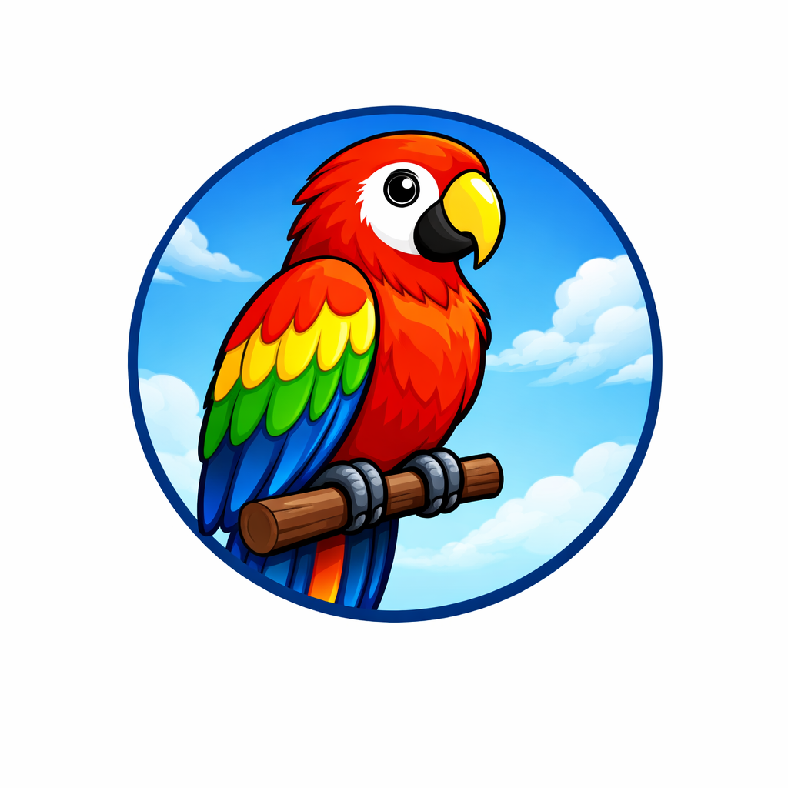

# Workshop Radar



A Streamlit dashboard and scheduled discovery pipeline for finding academic
workshops across biomedical computing, computer science, software engineering,
AI/ML, security and privacy, distributed systems, networking, and systems.
It tracks workshops only. Conference deadline tracking should live in the
separate conference dashboard.

The pipeline is designed to be year-over-year expandable. Every refresh checks
the current year and the next year, then parses a small set of known sources
instead of depending on one site or a general web search.

Maintained by [Madhava Gaikwad](https://www.linkedin.com/in/alignops/).

## How Discovery Works

The fetcher starts from curated workshop parent sources in `workshop_seeds.json`, then
parses known source pages. The first source parser is OpenReview's public
workshop listing, which surfaces many ACL, RLC, ICML, ICLR, MICCAI, and
related workshop groups directly.

Planned source parsers can be added for HotCRP, conf.researchr.org, USENIX,
ACM/IEEE workshop pages, AMIA, ISCB, and other biomedical sources.

For each candidate result, the fetcher applies lightweight NLP heuristics:

- classify areas from text signals such as biomedical, AI/ML, security,
  networking, systems, or software engineering terms
- infer status: `confirmed`, `cfp_open`, `proposal_open`, `candidate`, or
  `expected`
- extract visible date mentions from result text
- assign confidence based on source type and status
- deduplicate repeated results across sources

If source fetching is unavailable, the fetcher can still emit source-gap
placeholders for every seed source and target year.

## Safety Guardrails

Every record includes a `safety` object. The dashboard uses it to separate
actionable leads from discovery-only placeholders.

Current checks:

- the result mentions the target year
- the result has a workshop signal
- the source is trusted, such as an official workshop source, OpenReview, HotCRP,
  conf.researchr.org, USENIX, ACM, IEEE, AMIA/ISCB/MICCAI-style sources
- the inferred status is actionable
- the record is not a generated source-gap placeholder

The app still shows lower-confidence leads because they are useful for
exploration, but they are labeled as needing verification. Workshop dates and
submission deadlines should always be verified on the linked official source
before submitting.

## Layout

```text
workshop_seeds.json          # workshop parent sources, domains, and areas
conference_sources.json      # conference-deadline feeds used first for venue targets
venue_watchlist.json         # broad top-venue coverage targets by area
fetcher/fetch.py             # known-source parser pipeline
data/workshops.json          # generated discovery snapshot
assets/logo.png              # app icon and dashboard logo
assets/thumbnail.png         # repo/deployment thumbnail image
app.py                       # Streamlit dashboard
docs/                        # GitHub Pages SEO landing page and crawler files
.github/workflows/refresh-workshops.yml  # daily GitHub Actions refresh
requirements.txt
```

## Running Locally

```bash
python3 -m venv .venv
source .venv/bin/activate
pip install -r requirements.txt

# Live discovery through known source parsers
python fetcher/fetch.py

# Offline source-gap snapshot, useful for development
python fetcher/fetch.py --offline

streamlit run app.py
```

The dashboard reads `data/workshops.json`.

## Deployment

The intended setup for the new GitHub repo is:

1. GitHub Actions runs `fetcher/fetch.py` daily and commits
   `data/workshops.json`, `static/workshops.json`, and
   `docs/workshops.json`.
2. Streamlit Community Cloud deploys `app.py` from the same repo.
3. GitHub Pages publishes `docs/` as the indexable landing page and root
   crawler-policy surface.

Create a new GitHub repo for this project before pushing. This local copy has no
remote configured by default, so it cannot update the original source repo.

The existing conference dashboard can be linked from the Streamlit UI, but its
data and automation are intentionally separate from this workshop tracker.

## SEO and AI Discovery

Streamlit is the interactive app, but crawlers do better with plain static
HTML. The repo therefore includes a GitHub Pages site in `docs/` with:

- `index.html` with a real `<title>`, meta description, OpenGraph/Twitter tags,
  visible explanatory copy, and JSON-LD dataset markup
- `robots.txt` with an AIPREF-style `Content-Usage` preference
- `aipref.txt`, `llms.txt`, and `ai.txt` for AI assistants and crawlers
- `workshop-radar.json` and `workshops.json` for machine-readable data

The Streamlit app also ships matching files under `static/`, but Streamlit
serves them below `/app/static/` rather than at the domain root. GitHub Pages is
the recommended indexable front door.

## Editing Seeds

Edit `conference_sources.json` to point at the conference-deadline feed used
first for venue discovery. The default local source is the adjacent
`paper_tracker/data/conferences.json`, which represents the conference
dashboard plus CCFDDL, ai-deadlines, sec-deadlines, and tcs-conf data.

Edit `workshop_seeds.json` to add or remove known source-parser seeds. Each
seed can include one or more likely official domains. Source parsers use those
domains to map source records back to your research areas.

Edit `venue_watchlist.json` for broad coverage targets. These entries are not
claims that a workshop exists; they keep top venues visible year-over-year so
the dashboard does not miss areas such as reinforcement learning, theory,
databases, programming languages, systems, distributed systems, networking, or
software engineering while source parsers mature.
